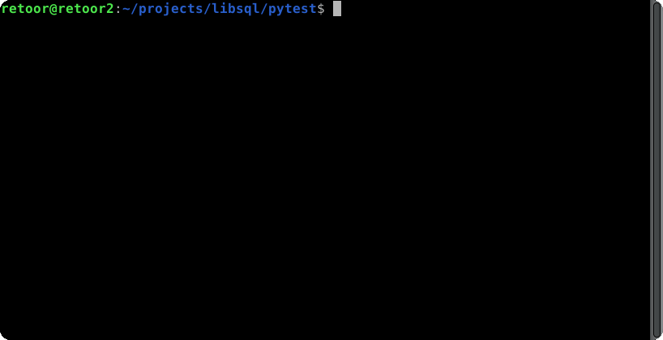

# Benchmark libsql-client

This project benchmarks the python libsql-client to determine performance differences between local file database and the libsql database server.

## Requirements

1. Docker for the libsql server installation
2. The libsql server running on default port 8080. Checkout the repository of libsql and run `docker compose up` in the docker-compose folder. Building can take around 10 to 15 minutes.

## Usage 

You only have to run `make`. This will create a new python environment, installs the requirements and runs the application.

Running without rebuilding environment is doable using `make bench`.
To (re)install but not run execute `make install`.

## Screen recording
Can take some time to load. It's more than a mb. 

